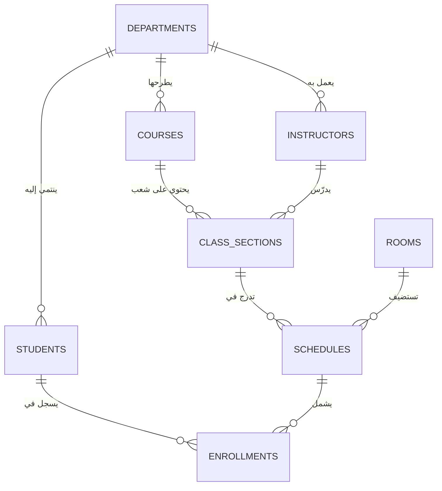

# دليل هيكل وقاعدة بيانات نظام الجامعة (University System)

هذا المستند يوفر شرحاً تفصيلياً وبنية الجداول والعلاقات المتبادلة لقاعدة بيانات **نظام الجامعة (University System)**. تم تصميمه ليكون مرجعاً شاملاً للمناقشة التقنية ومراجعة تصميم قاعدة البيانات.

---

## 🗺️ مخطط العلاقات (Entity-Relationship Diagram)

يوضح المخطط التالي كيفية ترابط الكيانات الأكاديمية والبشرية ببعضها البعض داخل النظام:

---

## 📊 تفاصيل وفحص الجداول (Tables Schema)

### 1. جدول الأقسام (`Departments`)
الجدول الأساسي لتصنيف الكيانات الأكاديمية والإدارية.
* **الأعمدة:**
  * `DepartmentID` (مفتاح رئيسي / Primary Key - Integer)
  * `DepartmentName` (اسم القسم / Department Name - Text)
* **مثال للبيانات:**
  | DepartmentID | DepartmentName |
  | :--- | :--- |
  | 1 | AI |
  | 2 | CS |
  | 3 | IS |

---

### 2. جدول الطلاب (`Students`)
يخزن البيانات الشخصية والأكاديمية للطلاب.
* **الأعمدة:**
  * `StudentID` (مفتاح رئيسي / Primary Key - Integer)
  * `StudentName` (اسم الطالب - Text)
  * `age` (العمر - Integer)
  * `DepartmentID` (معرف القسم / Foreign Key - يربط بـ `Departments`)
  * `Gender` (الجنس - Text)
  * `BirthDate` (تاريخ الميلاد - DateTime)
  * `Email` (البريد الإلكتروني - Text)
  * `Phone` (رقم الهاتف - Text)
  * `Address` (العنوان - Text)
* **مثال للبيانات:**
  `1, Ahmed, 25, 1, Male, 2026-05-07 00:00:00, brax42@gmail.com, +20 105866856, Cairo, Egypt`

---

### 3. جدول الأساتذة (`Instructors`)
يحتوي على بيانات أعضاء هيئة التدريس ومستواهم الوظيفي.
* **الأعمدة:**
  * `InstructorID` (مفتاح رئيسي / Primary Key - Integer)
  * `InstructorName` (اسم الأستاذ - Text)
  * `DepartmentID` (القسم التابع له / Foreign Key - يربط بـ `Departments`)
  * `Email` (البريد الإلكتروني - Text)
  * `HireDate` (تاريخ التعيين - DateTime)
* **مثال للبيانات:**
  `1, Dr. mohamed, 1, mohamed@university.edu, 2020-09-01 00:00:00`

---

### 4. جدول المقررات الدراسية (`Courses`)
المواد التعليمية المطروحة في الجامعة.
* **الأعمدة:**
  * `CourseID` (مفتاح رئيسي / Primary Key - Integer)
  * `CourseName` (اسم المقرر - Text)
  * `credits` (عدد الساعات المعتمدة - Integer)
  * `DepartmentID` (القسم المسؤول / Foreign Key - يربط بـ `Departments`)
* **مثال للبيانات:**
  | CourseID | CourseName | credits | DepartmentID |
  | :--- | :--- | :--- | :--- |
  | 1 | Database | 3 | 1 |
  | 2 | Programing | 4 | 2 |

---

### 5. جدول الشُّعب الدراسية (`Class_Sections`)
يمثل الفصول الفردية المطروحة لكل مقرر في ترم معين.
* **الأعمدة:**
  * `SectionID` (مفتاح رئيسي / Primary Key - Integer)
  * `CourseID` (المقرر / Foreign Key - يربط بـ `Courses`)
  * `Semester` (الفصل الدراسي - Text)
  * `InstructorID` (الأستاذ المحاضر / Foreign Key - يربط بـ `Instructors`)
* **مثال للبيانات:**
  `1, 1, Fall 2026, 1` (شعبة مادة قواعد البيانات لخريف 2026 ويدرسها د. محمد)

---

### 6. جدول القاعات الدراسية (`Rooms`)
الأماكن والمدرجات المتاحة لإقامة المحاضرات.
* **الأعمدة:**
  * `RoomID` (مفتاح رئيسي / Primary Key - Integer)
  * `Building` (المبنى - Text)
  * `Capacity` (السعة الاستيعابية - Integer)
* **مثال للبيانات:**
  | RoomID | Building | Capacity |
  | :--- | :--- | :--- |
  | 1 | A | 30 |
  | 2 | B | 100 |

---

### 7. جدول جدول المواعيد (`Schedules`)
الربط الزمني والمكاني للشعب الدراسية داخل القاعات.
* **الأعمدة:**
  * `ScheduleID` (مفتاح رئيسي / Primary Key - Integer)
  * `SectionID` (الشعبة / Foreign Key - يربط بـ `Class_Sections`)
  * `RoomID` (القاعة / Foreign Key - يربط بـ `Rooms`)
  * `Class_Time` (وقت بدء المحاضرة - DateTime)
  * `End_Time` (وقت نهاية المحاضرة - DateTime)
* **ملاحظة فنية:** التواريخ التي تظهر كـ `1899-12-30` تعود إلى السلوك الافتراضي لـ MS Access عند حفظ الوقت فقط.
* **مثال للبيانات:**
  `1, 1, 1, 1899-12-30 09:00:00, 1899-12-30 11:00:00`

---

### 8. جدول تسجيل الطلاب والتقديرات (`Enrollments`)
يربط الطلاب بجداولهم الدراسية ويحفظ درجاتهم النهائية.
* **الأعمدة:**
  * `EnrollmentID` (مفتاح رئيسي / Primary Key - Integer)
  * `StudentID` (الطالب / Foreign Key - يربط بـ `Students`)
  * `ScheduleID` (المحاضرة / Foreign Key - يربط بـ `Schedules`)
  * `Grade` (التقدير - Text مثل A, B+, C)
* **مثال للبيانات:**
  `1, 1, 1, A`

---

## 🔗 تفصيل العلاقات وأسس تصميم قاعدة البيانات (Relationships Guide)

### 1. علاقة القسم مع بقية الجداول (الأقسام ⬅️ الطلاب، الأساتذة، المقررات)
* **نوع العلاقة:** واحد إلى متعدد ($1:N$).
* **الشرح الأكاديمي:** القسم الواحد يمكن أن يضم العديد من الطلاب وأعضاء هيئة التدريس والمواد الأكاديمية، بينما كل طالب أو أستاذ أو مادة ينتمي لقسم واحد فقط.

### 2. علاقة الشُّعب والمقررات (المقررات ⬅️ الشُّعب)
* **نوع العلاقة:** واحد إلى متعدد ($1:N$).
* **الشرح الأكاديمي:** المادة الدراسية الواحدة يمكن تقسيمها إلى عدة شعب دراسية (لتفادي الكثافة العددية ولتوزيع الأساتذة)، ولكن كل شعبة تختص بمادة واحدة فقط.

### 3. علاقة الجدول والقاعات (القاعات ⬅️ مواعيد الجدول)
* **نوع العلاقة:** واحد إلى متعدد ($1:N$).
* **الشرح الأكاديمي:** القاعة الواحدة (مثل مدرج A) تستضيف العديد من المحاضرات طوال اليوم الدراسي، ولكن في موعد الجدول الفردي المحدد، تقام المحاضرة في قاعة واحدة فقط.

### 4. علاقة تسجيل الطلاب (الطلاب 🔁 مواعيد المحاضرات)
* **نوع العلاقة:** متعدد إلى متعدد ($M:N$).
* **طريقة الحل:** قمنا بكسر هذه العلاقة عبر **جدول وسيط (Junction Table)** وهو جدول التسجيل (`Enrollments`).
* **الشرح الأكاديمي:** الطالب يمكنه تسجيل العديد من المحاضرات والمواد، والمحاضرة الواحدة تضم العديد من الطلاب. نقوم باستخدام جدول `Enrollments` لربطهم ببعض، وهو المكان المثالي لحفظ نتيجة الطالب في تلك المادة (`Grade`).

---

## 💎 نقاط تقنية قوية للمناقشة
* **التطبيع (Normalization):** تم تصميم وتطبيع هذه الجداول إلى المستوى العياري الثالث (**3NF**)، مما يقضي تماماً على تكرار البيانات غير المبرر ويوفر سلامة إدخال وتعديل البيانات.
* **السلامة المرجعية (Referential Integrity):** تضمن العلاقات عدم إدخال درجات لطالب غير مسجل، أو حجز قاعة لمحاضرة في وقت متعارض، أو إسناد شعبة لمادة غير معرّفة.
